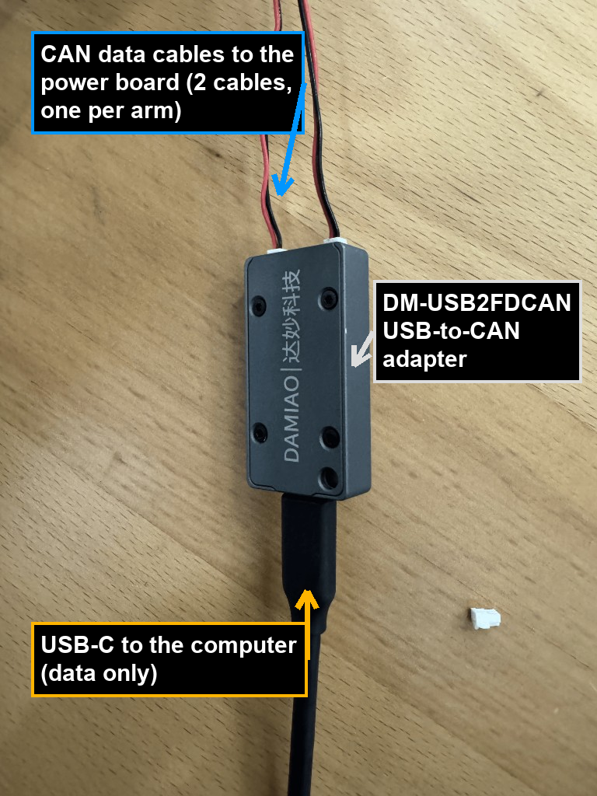
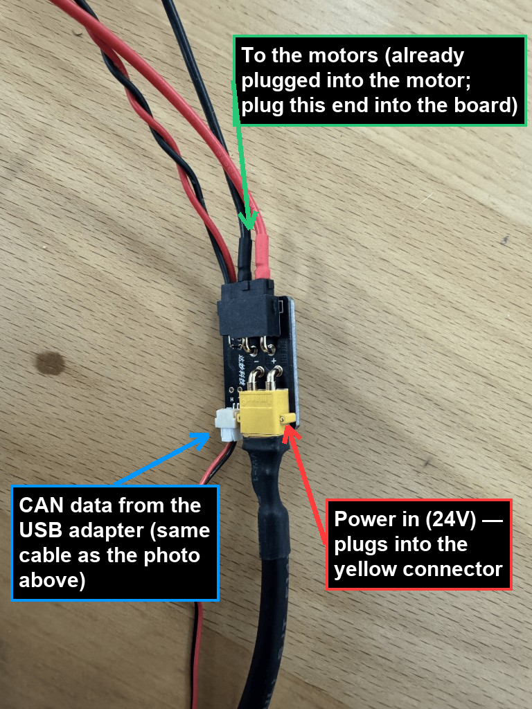

# DaMiao Motor Dashboard — User Guide

A web dashboard for controlling **DaMiao (达妙) DM-series motors** — including
multi-joint robot arms such as **OpenArm** and **Aloha** — from your browser.

This guide is written for the people who actually run the rig. It walks you
through setup from a clean machine, day-to-day operation, and a detailed
**troubleshooting** section for when something misbehaves (replugging, restarting
the terminal, re-calibrating, recovering from faults, and so on).

## Where to start

- **Setting up a new machine?** Go straight to **[Section 3 — First-time setup
  (clean machine)](#3-first-time-setup-clean-machine)**. You only do it once.
- **Machine already set up?** Open a terminal in this folder and run `./run.sh`,
  then open <http://127.0.0.1:5000> and follow the on-screen wizard:
  **Choose arm → Scan → Connect All → Calibrate → Controls**.

## Contents

1. [What this is and how it's wired](#1-what-this-is-and-how-its-wired)
2. [What's in this folder](#2-whats-in-this-folder)
3. [First-time setup (clean machine)](#3-first-time-setup-clean-machine)
4. [Plug-in checklist (every session)](#4-plug-in-checklist-do-this-every-session)
5. [Running the dashboard (every day)](#5-running-the-dashboard-every-day)
6. [Using the dashboard — step by step](#6-using-the-dashboard--step-by-step)
7. [Safety notes](#7-safety-notes-please-read)
8. [Troubleshooting](#8-troubleshooting)
   - [Adapter not detected / scan finds nothing](#81-can-adapter-not-detected--scan-finds-nothing)
   - [A motor doesn't show up in the scan](#82-a-motor-doesnt-show-up-in-the-scan)
   - [A motor won't enable / keeps dropping out](#83-a-motor-connects-but-wont-enable--keeps-dropping-out)
   - [A motor shows a hardware fault](#84-a-motor-shows-a-hardware-fault)
   - [Calibration fails](#85-calibration-fails-no-hardstop-detected-span-too-small-etc)
   - [Re-calibrate a joint from scratch](#86-i-need-to-re-calibrate-a-joint-from-scratch)
   - [Web page won't load / "address already in use"](#87-the-web-page-wont-load--address-already-in-use)
   - [Dashboard frozen / telemetry stopped](#88-the-dashboard-is-frozen-telemetry-stopped-or-its-just-acting-weird)
   - ["ModuleNotFoundError" / app won't start](#89-modulenotfounderror-or-the-app-wont-start)
   - [Getting help / reporting a problem](#810-getting-help--reporting-a-problem)
9. [Advanced: environment overrides](#9-advanced-environment-overrides)
10. [Quick reference](#10-quick-reference)

---

## 1. What this is and how it's wired

The motors talk the DaMiao **MIT CAN protocol**. Your computer talks to them
through a **DM-USB2FDCAN** USB-to-CAN adapter. When plugged in, it shows up in
`lsusb` looking like this:

```
Bus 003 Device 005: ID 34b7:6632 DaMiao-Tech DM-USB2FDCAN
```

The `Bus`/`Device` numbers will be different on your machine — that's fine. The
part that matters is the USB ID **`34b7:6632`** and the `DM-USB2FDCAN` name.

- The adapter runs in **USB mode**: the real control data flows over a
  vendor-specific bulk USB interface. (There is also a `/dev/ttyACM0` debug
  serial port — it is **not** used for control, so you can ignore it.)
- A **dual** adapter exposes **two CAN channels** (`0` and `1`). A common
  layout is **one robot arm per channel**.
- Each motor on a bus has a **CAN ID**. For an 8-joint arm the joints are
  usually IDs **1–8** (shown in the UI as **J1–J8**).
- The control software is built on the official DaMiao `DM_Device` SDK, accessed
  through the [`motorbridge`](https://pypi.org/project/motorbridge/) Python
  package.

### Important: motors need their own power

The USB adapter only carries **data**. Each motor needs its **own power supply**
(typically **24 V**). USB alone will *not* make a motor move. If a motor is
detected but won't energize or keeps dropping out, **check the power supply
first** (see Troubleshooting).

### How it's wired (photo guide)

The motors come **already plugged into each other** — you only need to connect
two things: the **USB-to-CAN adapter** (data) and the **power board** (24 V).

**1. The USB-to-CAN adapter.** Its **USB-C** cable runs to the computer. The
**two CAN data cables** out the top each go to a power board (one per arm).



**2. The power board.** Three things connect here:

- **To the motors** — the bundle along the top (one thick lead) is **already
  plugged into the motor**; just plug the other end into the board.
- **CAN data** — the skinny connector on the side is the **same cable that comes
  off the top of the adapter** above.
- **Power in (24 V)** — plugs into the **yellow** connector.



---

## 2. What's in this folder

| File | What it is |
| --- | --- |
| `run.sh` | Starts the dashboard. This is the one you'll use day to day. |
| `setup_udev.sh` | One-time USB permission setup (so you don't need `sudo`). |
| `app.py` | The web server (the dashboard's "front door"). |
| `backend.py` | The motor control engine (connection, calibration, the 50 Hz control loop). |
| `templates/index.html` | The dashboard web page you interact with. |
| `requirements.txt` | The Python packages the app needs. |
| `calibrations.json` | Saved calibration for each joint. **Auto-generated — don't hand-edit.** |
| `arm_sides.json` | Saved Left/Right side for each arm (channel). **Auto-generated — don't hand-edit.** |
| `probe_arms.py` | Diagnostic script to list which motors answer on each channel. |

---

## 3. First-time setup (clean machine)

> **START HERE on a new machine.** Run these five steps once, in order, then you
> never need them again. Already set up? Skip to
> [Section 5: Running the dashboard](#5-running-the-dashboard-every-day).

### Requirements

- **Linux** (the adapter driver here is built for Linux x86-64).
- **Python 3.10 or newer** with the `venv` module.
- The **DM-USB2FDCAN adapter** and at least one **powered** motor.

### Step 3.1 — Open a terminal in this folder

Clone the repository (or copy this folder onto the machine), then `cd` into it:

```bash
git clone https://github.com/RoboticsCenter/aloha-openarm.git
cd aloha-openarm
```

If you already have the folder, just `cd` into wherever it lives on your machine.

### Step 3.2 — Create the Python environment and install dependencies

```bash
python3 -m venv venv
./venv/bin/pip install --upgrade pip
./venv/bin/pip install -r requirements.txt
```

### Step 3.3 — Download the DaMiao driver runtime

The adapter needs a binary driver (`libdm_device.so`). Fetch it once:

```bash
./venv/bin/motorbridge-install-dm-device --download
```

This caches the driver under `~/.cache/motorbridge/...`. `run.sh` finds it
automatically afterward.

### Step 3.4 — Grant USB access (one time)

By default, talking to raw USB requires root. This script installs a permission
rule so you can run the dashboard **without `sudo`** going forward:

```bash
./setup_udev.sh
```

It will ask for your `sudo` password. It does two things:

1. Installs a udev rule for the adapter (USB vendor `34b7`, product `6632`).
2. Adds your user to the `plugdev` group.

> **Important:** if you were just added to `plugdev`, that change only takes
> effect after you **log out and back in** (or simply **unplug and replug** the
> adapter). If you skip this, the dashboard may report "CAN adapter not
> detected" even though it's plugged in.

**Alternative (no udev):** you can instead always launch with root:
`sudo -E ./venv/bin/python app.py`. The udev route is cleaner and recommended.

### Step 3.5 — Verify the adapter is visible

```bash
lsusb | grep 34b7
```

You should see the `DaMiao-Tech DM-USB2FDCAN` line. If you don't, the adapter
isn't plugged in / powered / recognized — fix that before continuing.

---

## 4. Plug-in checklist (do this every session)

Before launching the dashboard:

1. **Plug in the USB adapter** to the computer.
2. **Power on the motors** (24 V supply on, connectors seated).
3. Confirm the data and power cabling to the arm is connected.
4. (Optional) Confirm the adapter is seen: `lsusb | grep 34b7`.

---

## 5. Running the dashboard (every day)

```bash
./run.sh
```

You'll see:

```
Starting dashboard on http://127.0.0.1:5000
```

Open **<http://127.0.0.1:5000>** in your browser.

To stop the dashboard, return to the terminal and press **Ctrl-C**.

> The dashboard binds to `127.0.0.1` (this machine only) by default. To reach it
> from another computer on the network, start it with
> `HOST=0.0.0.0 ./run.sh` and browse to `http://<this-machine-ip>:5000`.

---

## 6. Using the dashboard — step by step

The dashboard guides you through a wizard: **Choose arm → Connect → Calibrate →
Controls**. There's also a built-in tutorial (look for **ⓘ Show tutorial**).

### Step 6.1 — Choose your arm

Pick **OpenArm** or **Aloha** at the top. This tailors the calibration flow:

- **OpenArm** — joints **auto-calibrate** (the software finds the hardstops for
  you).
- **Aloha** — joints are calibrated **by hand** (you move each joint to its
  stops and mark them).

### Step 6.2 — Connect

1. Click **Scan for Motors**. This probes IDs 1–8 on the bus (both channels on a
   dual adapter) and lists every joint that answers.
2. Click **Connect All Motors**. The app opens the bus and **auto-detects each
   motor's model** from its internal limits (PMAX/VMAX/TMAX), so command scaling
   is correct.
3. If a motor isn't found by the scan, use **Add motor manually** (enter its CAN
   ID, model, and channel).

When at least one motor is connected, click **Continue to Calibration →**.

### Step 6.3 — Calibrate

Calibration finds each joint's **range of motion** and sets its **zero point**.
After calibration, the UI sliders and the backend both refuse to drive a joint
past its real hardstops — this is an important safety feature.

**OpenArm (automatic):**

- Click **Calibrate All Motors**. Each joint, one at a time, slowly creeps to
  one hardstop, then the other. The two stops become the joint's position
  min/max.
- **Where zero ends up** depends on the joint:
  - **Most joints** zero at the **midpoint** between the two stops (the joint
    drives there and stores it as `0 rad`).
  - **The base joints (J1 and J2)** instead zero at their **natural resting
    (hanging) position**: after finding both stops the joint is released, allowed
    to settle where gravity leaves it, and that spot becomes `0 rad`. These joints
    are then left **limp** at home rather than being driven to a center.
- Some joints (notably **J4**) need extra "breakaway" effort and are handled with
  a special profile automatically.
- If a loaded joint can't be auto-calibrated, switch that joint to **Manual
  Calibration** (see below).

**Aloha (manual), or any joint that won't auto-calibrate:**

1. On the joint, open **Manual calibration**.
2. **Disable** the joint (so it moves freely by hand) or use **Enable to move**
   for guided jogging.
3. Move it to the **rear** hardstop → click **Mark Rear Stop**.
4. Move it to the **front** hardstop → click **Mark Front Stop**.
5. Move it to the displayed **midpoint** → click **Confirm & Zero**.

Calibration is **saved to disk** (`calibrations.json`) and reloaded
automatically next time you connect that joint — you don't have to re-calibrate
every session unless something changes.

> You can **Skip for now** to jump to the controls without calibrating, but the
> joint will then allow its full electrical range with no soft limits. Only do
> this if you know what you're doing.

### Step 6.4 — Controls

At the top of the Controls step is a **Controls** action bar with whole-arm
buttons:

- **Enable All** — powers on every motor on the arm at once.
- **Return Home** — drives calibrated joints back to their zero position.
- **Disable All** — releases every motor on the arm (they go limp).

Next to those is a **Show live motor data** toggle. By default each joint card
shows just the move slider (and a *Currently at … rad* readout); tick the toggle
to also reveal each motor's live position, velocity, torque, temperatures, and
rolling plot.

Below the action bar you get a card for **each joint** (J1…J8).

> **Two-arm setups:** if more than one arm is detected, a row of **arm tabs**
> appears at the top of the controls so you can switch between them. An arm that
> was found during the scan but has **no motors connected yet** shows up as a
> **greyed-out (disabled) tab** — that's normal. Connect its motors (back in the
> Connect step) and the tab becomes selectable.

For each joint card:

1. **Enable** — energizes the motor.
2. Choose a **control mode** (under **Advanced**):
   - **MIT** (impedance control): set **Kp** > 0, then drag **Move joint**
     to move. Add **Kd** for damping. Optional feed-forward velocity/torque.
     This is the most common mode.
   - **Position**: smooth move to a target position, capped by a velocity limit.
   - **Force-Pos**: position target with a velocity limit and a force ratio.
3. Drag the slider (or type an exact number) to command the joint.
4. **Disable** cuts torque to that joint (use **Return Home** in the action bar
   above to send the whole arm back to zero first).

Other handy controls:

- **Download Motor Data** — saves a JSON snapshot (live telemetry, setpoints,
  calibration bounds, limits, connection info). Useful for support/debugging.
- **Default Kp/Kd preset** — set comfortable gains once and apply to all joints.
- **Show tutorial** — replays the guided walkthrough.

With **Show live motor data** enabled, position / velocity / torque, motor
temperatures, and a rolling plot update about 20 times a second.

### The big red button: EMERGENCY STOP

**E-STOP ALL** (top-right, always visible) **immediately cuts torque to every
motor** and zeroes all setpoints. Use it any time something looks wrong.

There's also a **keyboard shortcut** — press **Space** anywhere (except while
typing in a field) to fire the E-stop. You can rebind it with the **E-stop key:**
button in the header: click it, then press the key you want.

E-STOP is **latching**: once pressed, motors stay disabled until you explicitly
**Enable** them again. This is intentional — it prevents a motor from silently
re-energizing.

---

## 7. Safety notes (please read)

- **Each motor needs its own 24 V supply.** USB does not power the motors.
- **Start small.** Begin with low **Kp** and low torque; increase gradually. The
  dashboard clamps every command to the motor's PMAX/VMAX/TMAX limits, but good
  habits matter.
- **Keep hands clear** during auto-calibration — joints move on their own to find
  the hardstops.
- **The motors fault to a safe state if commands stop arriving.** While a motor
  is enabled, the software streams its setpoint continuously (50 Hz) to keep it
  alive. This is why you must leave `run.sh` running.
- If a motor reports a **hardware fault** (over-current, over-temperature,
  over-voltage, etc.), the software **latches it off** and will *not* auto
  re-energize it. Fix the underlying condition before re-enabling.

---

## 8. Troubleshooting

Work top to bottom — the earlier items are the most common fixes. The single
most effective recovery sequence for weird behavior is:

> **1) E-STOP ALL → 2) Disable → 3) Re-enable → 4) if still wrong, stop `run.sh`
> (Ctrl-C), replug the adapter, restart `./run.sh`.**

### 8.1 "CAN adapter not detected" / scan finds nothing

1. **Is it plugged in?** Run `lsusb | grep 34b7`. No line = the OS doesn't see
   the adapter. Replug it, try a different USB port/cable.
2. **Permissions.** If you just ran `setup_udev.sh`, you must **log out/in** or
   **replug** for the `plugdev` membership to apply. Quick check:
   ```bash
   id -nG | grep plugdev      # your user should be listed
   ```
   If it's missing, re-run `./setup_udev.sh` and then log out/in.
3. **Replug, then restart the app.** Unplug the adapter, plug it back in, stop
   the dashboard (**Ctrl-C** in the terminal), and run `./run.sh` again.
4. **Last resort:** launch with root to rule out permissions:
   ```bash
   sudo -E ./venv/bin/python app.py
   ```
   If it works under `sudo` but not normally, the fix is the udev/`plugdev` setup
   in [Step 3.4](#step-34--grant-usb-access-one-time).

### 8.2 A motor doesn't show up in the scan

1. **Power.** Confirm that motor's 24 V supply is on and its connector is seated.
2. **It may have a non-standard ID.** Run the diagnostic probe to see exactly
   what answers on each channel:
   ```bash
   ./venv/bin/python probe_arms.py
   ```
   This lists IDs 1–8 on channels 0 and 1, including motors with unusual
   feedback IDs that the quick scan can miss.
3. **Add it manually** in the Connect step using the CAN ID, model, and channel
   that the probe reported.
4. **Re-scan.** Sometimes a second **Scan** picks up a motor that was still
   powering up during the first.

### 8.3 A motor connects but won't enable / keeps dropping out

Symptom: the joint flips back to disabled, or the UI shows "motor keeps dropping
out of enabled state."

1. **Power supply.** This is almost always a power/wiring problem — under-voltage
   or a loose connector. Check the 24 V supply and the CAN/power harness.
2. **E-STOP latch.** If you pressed E-STOP (or a fault latched it), you must
   click **Enable** again — the motor will not come back on its own.
3. **Disable → Enable.** Toggle the joint off and on to re-assert its mode.
4. **Replug + restart** if it persists (see the recovery sequence at the top of
   this section).

### 8.4 A motor shows a hardware fault

The status will read something like *overcurrent*, *over-temperature*
(MOSFET or rotor), *undervoltage*, *overvoltage*, or *overload*. The software
**latches the motor off** so it can't re-energize into an unsafe condition.

1. **Stop and find the cause.** Over-temperature → let it cool. Over-current /
   overload → the joint is mechanically jammed or over-loaded; clear the
   obstruction. Under/over-voltage → check the power supply.
2. Once the condition is cleared, click **Enable** to clear the latch and bring
   the motor back.
3. If it immediately re-faults, **do not keep re-enabling it** — investigate the
   hardware.

### 8.5 Calibration fails ("no hardstop detected", "span too small", etc.)

1. **Make sure the joint can actually reach both stops** — nothing blocking it,
   cables not snagging.
2. **Heavy / loaded joints:** auto-calibration uses a limited torque budget on
   purpose. If the joint stalls under its own weight before reaching a stop, use
   **Manual Calibration** for that joint instead (move by hand, mark both stops,
   confirm at the midpoint).
3. **"Move joint to midpoint before saving"** during manual calibration just
   means the joint isn't close enough to the computed center yet — nudge it to
   the displayed midpoint value and click **Confirm & Zero** again.
4. **E-STOP aborts calibration.** If you (or a fault) hit E-STOP mid-calibration,
   it stops cleanly. Re-enable and start the calibration over.

### 8.6 I need to re-calibrate a joint from scratch

Calibration is remembered between sessions, so you only need to redo it if the
mechanics changed, the joint was reassembled, or the saved zero looks wrong.

- **Re-calibrate one joint:** open that joint, use **Clear calibration** (or just
  **Calibrate** again). This drops the saved soft limits so the joint can sweep
  its full range, then re-runs calibration.
- **Re-calibrate everything:** in the Calibrate step use **Re-calibrate All**.
- **Nuclear option:** stop the dashboard and delete the saved file:
  ```bash
  rm calibrations.json
  ```
  All joints will then be uncalibrated next launch and must be calibrated again.

### 8.7 The web page won't load / "address already in use"

1. **Is `run.sh` still running?** The terminal should be sitting on
   `Starting dashboard on http://127.0.0.1:5000`. If it exited, run `./run.sh`
   again.
2. **Port 5000 busy** (another copy still running). Either stop the old one, or
   start on a different port:
   ```bash
   PORT=5050 ./run.sh
   ```
   then open <http://127.0.0.1:5050>.
3. **Find and stop a stuck instance:**
   ```bash
   pkill -f "venv/bin/python app.py"
   ```

### 8.8 The dashboard is frozen, telemetry stopped, or it's just acting weird

This is the "turn it off and on again" path, in order of escalation:

1. **E-STOP ALL** to make the hardware safe.
2. **Restart the dashboard:** in the terminal press **Ctrl-C**, then run
   `./run.sh` again. Refresh the browser page.
3. **Replug the adapter:** stop the dashboard, unplug the USB adapter, wait a few
   seconds, plug it back in, then `./run.sh`.
4. **Power-cycle the motors:** turn the 24 V supply off and on, then reconnect in
   the dashboard.
5. **Full reset:** close the terminal entirely, open a fresh one in this folder,
   and start over from the [Plug-in checklist](#4-plug-in-checklist-do-this-every-session).

### 8.9 "ModuleNotFoundError" or the app won't start

The Python environment is missing or incomplete. Recreate it:

```bash
python3 -m venv venv
./venv/bin/pip install -r requirements.txt
./venv/bin/motorbridge-install-dm-device --download
```

Then `./run.sh` again. Always start the app with `./run.sh` (or
`./venv/bin/python app.py`) so it uses the project's virtual environment.

### 8.10 Getting help / reporting a problem

Click **Download Motor Data** in the dashboard and include that JSON file when
asking for support — it captures the live state, calibration, and limits that
make problems much faster to diagnose.

---

## 9. Advanced: environment overrides

Most people never need these. They're set as environment variables before
`run.sh` (e.g. `PORT=5050 ./run.sh`).

| Variable | Default | Meaning |
| --- | --- | --- |
| `HOST` | `127.0.0.1` | Web address to bind (`0.0.0.0` to allow other machines). |
| `PORT` | `5000` | Web port. |
| `DM_DEVICE_TYPE` | `usb2canfd-dual` | Adapter type for the DaMiao SDK. |
| `DM_CHANNEL` | `0` | Default CAN channel. |
| `DM_MODEL` | `4310` | Model hint used before auto-detect. |
| `CAL_SPEED_RAD_S` | `1.25` | Auto-calibration sweep speed. |
| `CAL_MIN_SPAN_RAD` | `0.75` | Minimum valid hardstop-to-hardstop span. |
| `DM_CALIBRATION_STORE` | `calibrations.json` | Where calibration is saved. |

> Note: the `usb2canfd-dual` device type is the one verified to work with this
> hardware; the plain `usb2canfd` and `linkx4c` types can crash the SDK on this
> adapter.

---

## 10. Quick reference

| I want to… | Do this |
| --- | --- |
| Start the dashboard | `./run.sh`, open <http://127.0.0.1:5000> |
| Stop the dashboard | **Ctrl-C** in the terminal |
| Stop a motor now | **E-STOP ALL** or press **Space** (then **Enable** to recover) |
| Find missing motors | `./venv/bin/python probe_arms.py` |
| Re-calibrate a joint | **Clear calibration** → **Calibrate** |
| Re-calibrate everything | **Re-calibrate All** (or `rm calibrations.json`) |
| Use a different port | `PORT=5050 ./run.sh` |
| Reach it from another PC | `HOST=0.0.0.0 ./run.sh` |
| Recover from weirdness | E-STOP → Ctrl-C → replug adapter → `./run.sh` |
